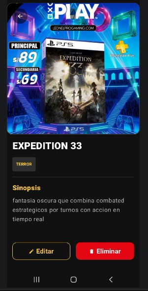
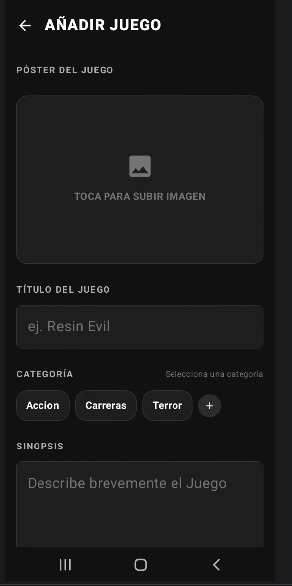
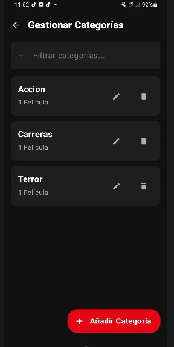

# GameOver  - Android CRUD

GameOver  es una aplicación nativa de Android que funciona como un CRUD para gestionar videojuegos y sus categorías correspondientes. Cuenta con una interfaz intuitiva y premium con temática oscura y acentos dorados, diseñada con Jetpack Compose.

## Instalación

1. Clonar el repositorio:
```bash
git clone https://github.com/RogerCll06/gameover-android.git
```

2. Abrir el proyecto en Android Studio (Ladybug o superior).
3. Sincronizar Gradle para descargar y configurar todas las dependencias.
4. Ejecutar la aplicación en un emulador o dispositivo físico Android.

## Estructura del Proyecto (MVVM)

El proyecto sigue el patrón de arquitectura **MVVM (Model-View-ViewModel)** y está estructurado de la siguiente manera:

```text
app/
├── src/
│   └── main/
│       ├── java/com/example/cineflow/
│       │   ├── data/                 # Capa de datos (Persistencia Room y Repositorios)
│       │   │   ├── local/            # Configuración de base de datos (AppDatabase, DAOs)
│       │   │   ├── model/            # Modelos de dominio y entidades (Play, Category)
│       │   │   └── repository/       # Repositorio central de datos (CineFlowRepository)
│       │   ├── ui/                   # Capa de presentación y componentes de UI
│       │   │   ├── components/       # Componentes comunes y reutilizables de Jetpack Compose (CineComponents)
│       │   │   ├── screens/          # Pantallas de la aplicación (Catalog, CategoryCrud, AddEditPlay, etc.)
│       │   │   ├── theme/            # Estilización (Colores, Tipografía y Tema oscuro)
│       │   │   └── viewmodel/        # Lógica de negocio y manejo de estado (CineFlowViewModel)
│       │   └── MainActivity.kt       # Punto de entrada de la aplicación y enrutador de estados basado en Compose
│       ├── res/                      # Recursos del proyecto (Strings, Iconos, Drawables)
│       └── AndroidManifest.xml       # Archivo de manifiesto y configuración general de Android
├── build.gradle.kts                  # Configuración de dependencias a nivel de módulo
└── settings.gradle.kts                # Configuración de módulos del proyecto
```

## Pantallazos

Las capturas de pantalla de la aplicación están organizadas en la carpeta `sceenshots/`.

### Videojuegos
| Catálogo | Detalle | Añadir / Editar |
| :---: | :---: | :---: |
|  |  |  |

### Categorías
| Listado y Gestión de Categorías |
| :---: |
|  |

## Tecnologías
- **Kotlin**: Lenguaje de programación oficial para el desarrollo nativo moderno.
- **Jetpack Compose**: Framework de UI declarativo moderno para crear interfaces fluidas.
- **Room (SQLite)**: Capa de abstracción sobre SQLite para almacenamiento de datos local estructurado y persistente.
- **State-Based Navigation**: Sistema de enrutamiento basado en estados integrados de Compose (`currentScreen`).
- **Coil**: Librería óptima para la carga y renderizado asíncrono de imágenes de portadas.

### Conceptos Fundamentales

*   **AndroidManifest.xml:** Archivo XML obligatorio en la raíz del conjunto de fuentes del proyecto Android. En él se declaran componentes clave como pantallas (`Activities`), servicios, permisos del sistema (internet, almacenamiento) y metadatos generales.
*   **Gradle Scripts:** Sistema de automatización de compilación moderno. Configura el SDK mínimo/objetivo, define dependencias externas (librerías), firma del APK y automatiza el empaquetado del software.

## 📬 Contacto

* 👨‍💻 Desarrollador: Roger Erik Concepción León
* 🐙 GitHub: https://github.com/RogerCll06
* 📧 Email: concepcionleonrogererik@gmail.com

---

⭐ Si te gustó este proyecto, no olvides dejar una estrella en el repositorio.


